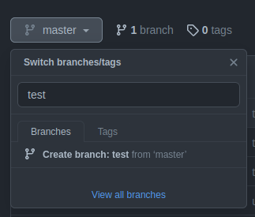
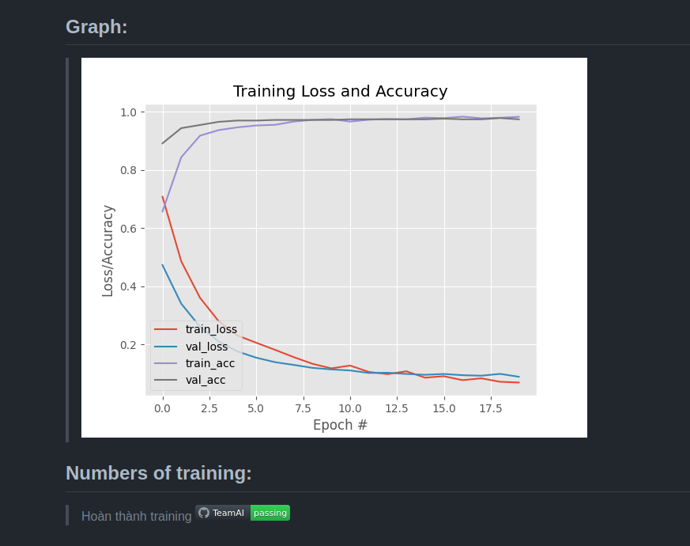

# Emotion Recognition

## Guide

1. ### **Train:**
    ***Structure in your PC:***

      > python3 train.py -d dataset (see more at [train.py](train.py))

    **With:** 
    - **Input:**

        + [dataset](dataset/pasteImageHereandDeleteThisFile.txt): path directory to dataset
        + [train.py](doc/sampleTrain.py): file to train your dataset
        + [requirements.txt](doc/requirements.txt): Using libraries
	
    - **Output:**

      + **.model
      + plot.png (graph when training process was finished)  
2. ### **Upload:**
    - Create branch (your own name on github)

    

    - git clone -b **your current branch name** https://github.com/sharonmann123/TeamAI.git
    - Open [CI_CD.yaml](doc/CI_CD.yaml), change **BranchName** to **your current branch name** then save it
    - Create path **.github/workflows**
    - Copy [CI_CD.yaml](doc/CI_CD.yaml) and paste it to **.github/workflows** 
    - Copy all file to folder TeamAI then commit and push

3. ### **Finish:**
  

> #### **With :** 
    image: plot.png
    passing: action is done

## Graph:
> 

## Numbers of training:
